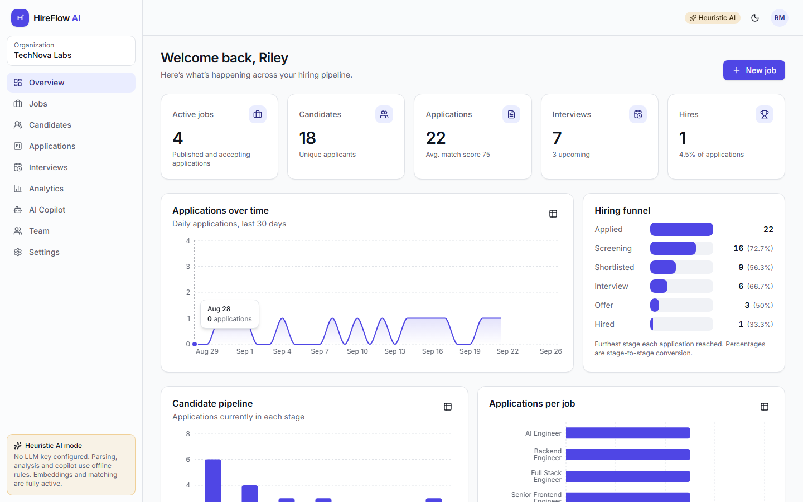
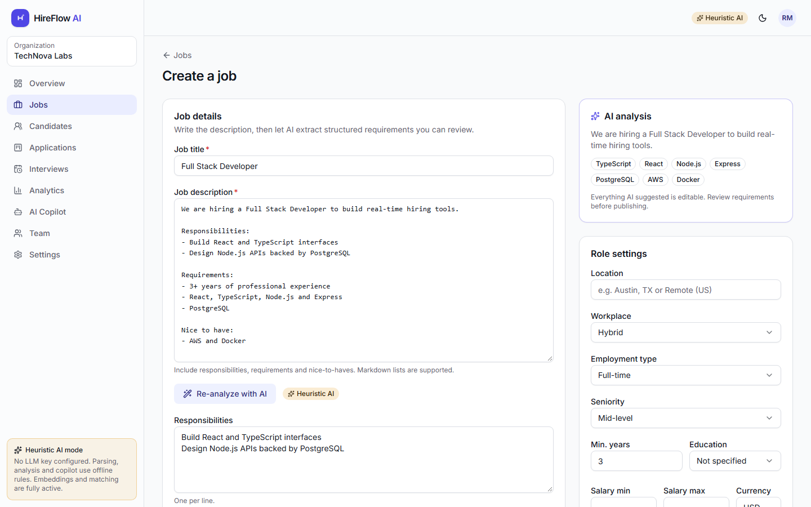
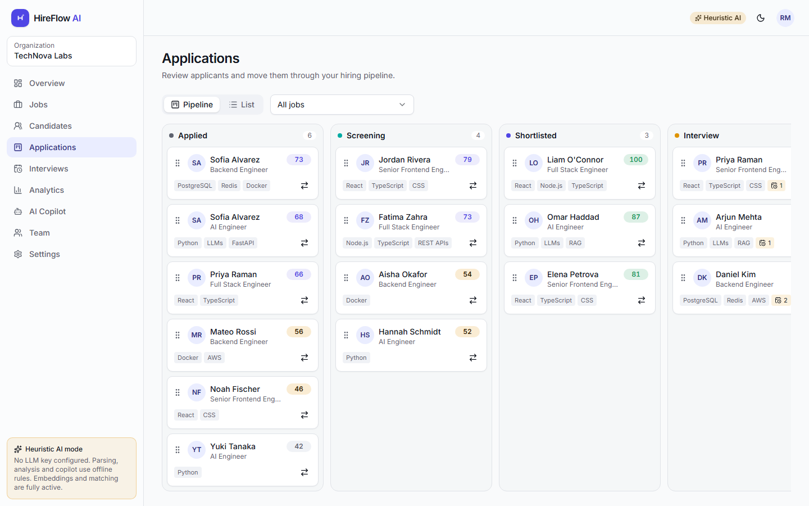
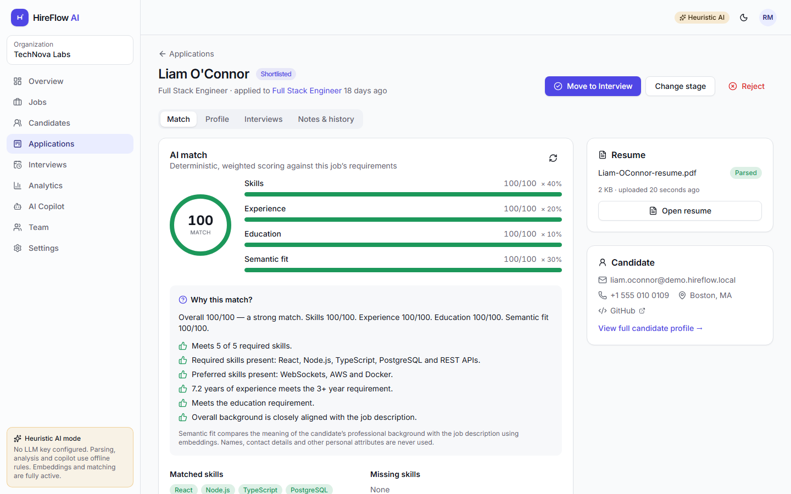
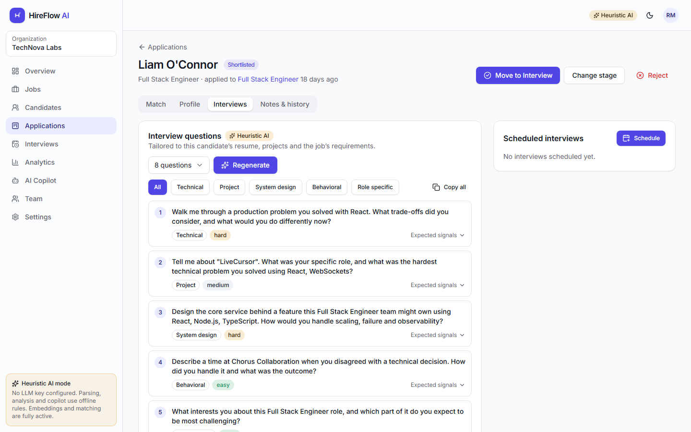
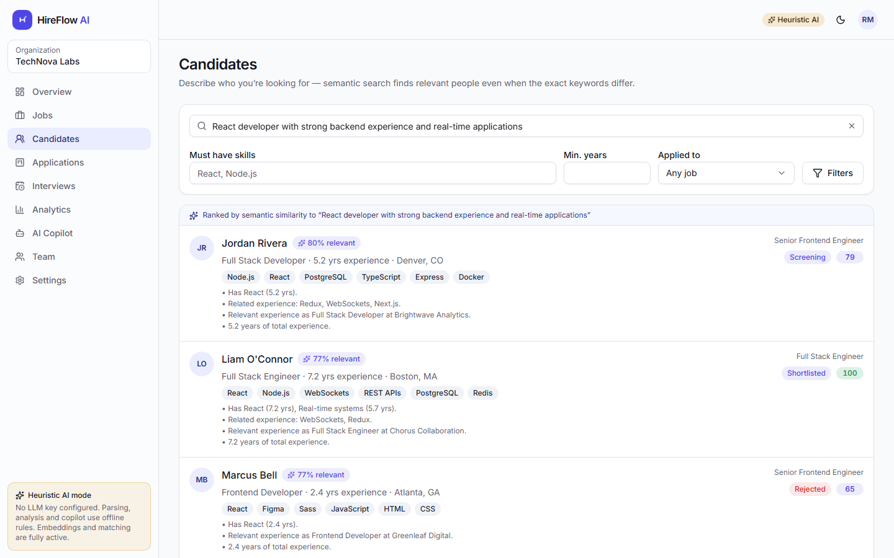
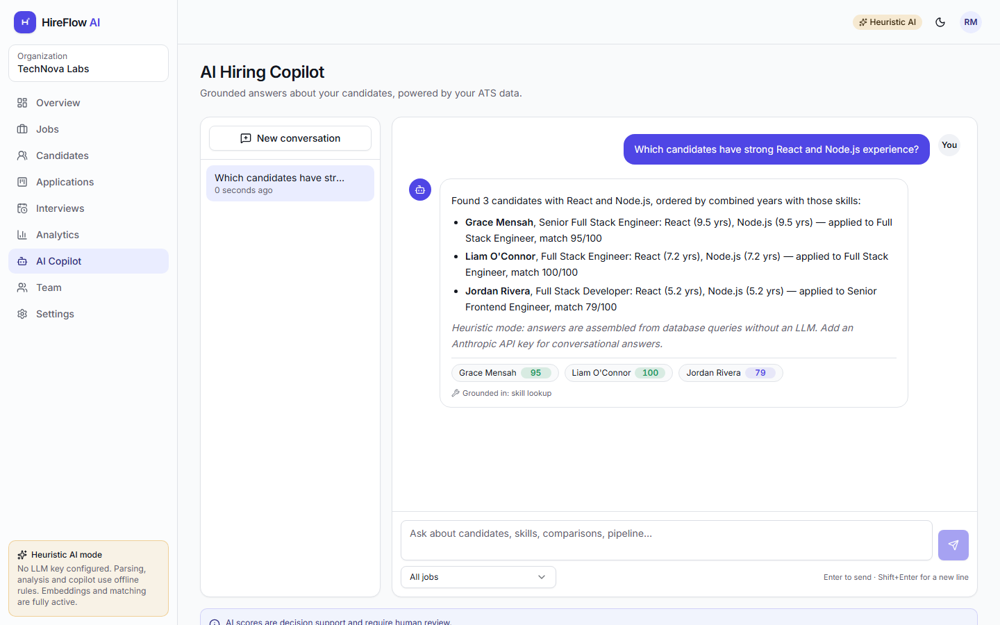
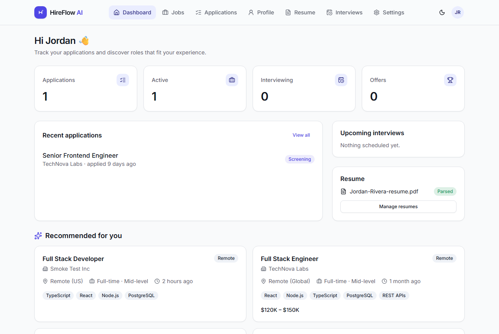
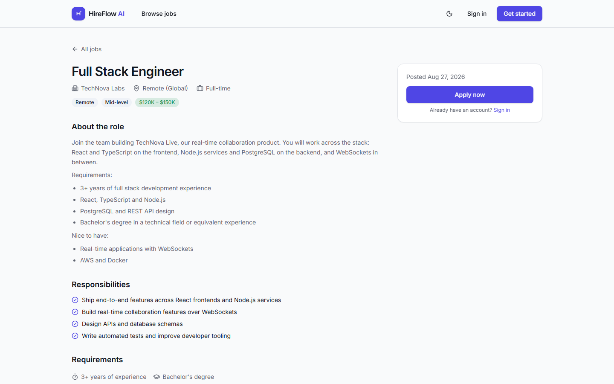

# HireFlow AI

**An AI-assisted Applicant Tracking System with explainable candidate matching.**

Recruiters publish jobs, receive applications, and get transparent, human-reviewed candidate
rankings. Resumes are parsed into structured profiles, embedded for semantic search, and scored
against job requirements with a deterministic algorithm whose every point can be explained.
Candidates get a portal to build a profile, upload resumes, apply and track their applications.



---

## Contents

- [Features](#features)
- [Screenshots](#screenshots)
- [Architecture](#architecture)
- [Tech stack](#tech-stack)
- [Getting started](#getting-started)
- [Environment variables](#environment-variables)
- [Database](#database)
- [Running locally](#running-locally)
- [Testing](#testing)
- [Deployment](#deployment)
- [Demo accounts](#demo-accounts)
- [AI: providers, fairness and limits](#ai-providers-fairness-and-limits)
- [Project documentation](#project-documentation)
- [Future improvements](#future-improvements)

## Features

**Recruiters**

- **Jobs** — create, edit, save drafts, publish, pause, close, reopen, duplicate, delete (only when no one applied).
- **AI job analysis** — paste a description; required/preferred skills, weights, years, education, seniority and responsibilities are extracted into an **editable** form before publishing.
- **Explainable matching** — every application gets an overall score from four weighted components (skills, experience, education, semantic fit), a per-requirement breakdown, matched/missing skills and a "Why this match?" explanation generated from the numbers, not by an LLM.
- **Semantic candidate search** — "React developer with strong backend experience and real-time applications" is embedded and searched with pgvector, combined with structured filters, with data-derived reasons for each hit.
- **Drag-and-drop pipeline** — Kanban across Applied → Screening → Shortlisted → Interview → Offer → Hired / Rejected with optimistic updates, rollback on failure, optimistic-concurrency conflicts and a full audit trail.
- **Interview kit** — candidate-specific questions (technical, project, system design, behavioral, role-specific) with difficulty and expected signals; interview scheduling, feedback and ratings.
- **AI Hiring Copilot** — a chat grounded in your ATS data through server-side, tenant-scoped tools. References are verified against retrieved candidates.
- **Analytics** — SQL-aggregated KPIs, application trend, pipeline, hiring funnel (furthest stage reached), score distribution, top skills, job performance.
- **Team & settings** — invite members with roles (owner, admin, recruiter, hiring manager), configurable matching weights, audit log.

**Candidates**

- Public job board with search and filters; apply in a few clicks.
- Resume upload (PDF) with live parsing status; the profile is filled automatically and stays editable.
- Dashboard with application status, upcoming interviews and semantically recommended jobs.
- Application timeline, interview details, withdraw, account settings. Mobile-friendly.

**Platform**

- Email/password auth with Argon2id, rotating refresh tokens with reuse detection, email verification, password reset, Google OAuth (when configured).
- Role-based access control enforced on the server for every route; tenant isolation on every query.
- Background processing (BullMQ) for resume parsing, embeddings, matching, email and analytics.
- Email notifications through a provider abstraction (SMTP/Mailpit, Resend, console).
- OpenAPI documentation generated from the same Zod schemas that validate requests.
- Structured logging with request IDs, Docker images, CI pipeline, unit/integration/E2E tests.

## Screenshots

|                                                                                |                                                                     |
| ------------------------------------------------------------------------------ | ------------------------------------------------------------------- |
|  |                 |
| **AI job analysis** — editable, structured requirements                        | **Pipeline** — drag-and-drop with optimistic updates                |
|                   |  |
| **Explainable match** — components, breakdown, "Why this match?"               | **Interview kit** — grounded in the candidate's projects            |
|                     |                          |
| **Semantic search** — pgvector + filters + reasons                             | **Copilot** — grounded answers with verified references             |
|             |               |
| **Candidate portal**                                                           | **Public job board**                                                |

Regenerate with `pnpm --filter @hireflow/web screenshots` against a running, seeded stack.

## Architecture

```text
Browser ──▶ web (React SPA) ──/api──▶ api (Express) ──▶ PostgreSQL + pgvector
                                         │    ▲
                                  enqueue│    │
                                         ▼    │
                                     Redis/BullMQ ──▶ worker (same codebase)
                                                        ├─ PDF text extraction
                                                        ├─ AI parsing (Claude / heuristic)
                                                        ├─ local embeddings (bge-small, ONNX)
                                                        ├─ matching, email, analytics
                                                        └─ S3-compatible storage (resumes)
```

- **Monorepo** (pnpm workspaces): `apps/api`, `apps/web`, `packages/shared` (Zod schemas, DTOs, enums, permission matrix, skill taxonomy, scoring engine), `packages/database` (Prisma schema, migrations, seed fixtures), `packages/config`.
- **API layering**: routes → controllers → services → repositories. One route table drives Express routing _and_ the OpenAPI document; handlers carry their Zod schemas.
- **AI layer**: an `AIProvider` interface with a Claude implementation and a clearly labelled offline heuristic implementation; a separate `EmbeddingProvider`; deterministic scoring in `@hireflow/shared`.

Details: [ARCHITECTURE.md](ARCHITECTURE.md) · [docs/AI_ARCHITECTURE.md](docs/AI_ARCHITECTURE.md) · [docs/DATABASE.md](docs/DATABASE.md) · [DECISIONS.md](DECISIONS.md)

## Tech stack

| Layer           | Choices                                                                                                                                                                          |
| --------------- | -------------------------------------------------------------------------------------------------------------------------------------------------------------------------------- |
| Frontend        | React 19, TypeScript (strict), Vite 7, Tailwind CSS v4, shadcn/ui-pattern components on Radix, React Router 7, TanStack Query 5, React Hook Form + Zod, Recharts, dnd-kit, Axios |
| Backend         | Node.js 22, Express 5, Zod 4, jose (JWT), Argon2id, Multer, pino, Helmet, express-rate-limit (Redis store), swagger-ui                                                           |
| Data            | PostgreSQL 16, Prisma 6, pgvector (HNSW, cosine)                                                                                                                                 |
| Jobs & cache    | Redis 7, BullMQ                                                                                                                                                                  |
| AI              | Anthropic Claude via `@anthropic-ai/sdk` (structured outputs, tool use), local `bge-small-en-v1.5` embeddings via Transformers.js/ONNX                                           |
| Storage & email | S3 API (`@aws-sdk/client-s3`; SeaweedFS locally), nodemailer (Mailpit locally) / Resend                                                                                          |
| Quality         | Vitest, Supertest, Testing Library, Playwright, ESLint 9, Prettier, GitHub Actions                                                                                               |
| Ops             | Docker (multi-stage, non-root), Docker Compose, nginx                                                                                                                            |

## Getting started

**Prerequisites:** Node.js ≥ 22, pnpm 9 (`npm i -g pnpm@9` or `corepack enable`), Docker.

```bash
git clone <repo> hireflow-ai && cd hireflow-ai
cp .env.example .env          # defaults work for local development
docker compose up -d          # Postgres (pgvector), Redis, S3 (SeaweedFS), Mailpit
pnpm install
pnpm db:migrate               # apply migrations
pnpm db:seed                  # TechNova Labs demo data through the real parse/embed/match pipeline
pnpm dev                      # API :4000, worker, web :5173
```

Open http://localhost:5173 and sign in with a [demo account](#demo-accounts).
API docs: http://localhost:4000/api/docs · Emails: http://localhost:8025 (Mailpit).

> The first run downloads the embedding model (~35 MB) into `.cache/models`.

**Full stack in Docker** (production images behind nginx on http://localhost:8080):

```bash
docker compose --profile app up -d --build
docker compose exec -e ALLOW_DEMO_SEED=true api node dist/seed.js   # optional demo data
```

## Environment variables

All configuration is validated at startup (`apps/api/src/config/env.ts`); invalid configuration fails fast with a readable list. See [.env.example](.env.example) for every variable.

| Variable                                                  | Purpose                                                                                     |
| --------------------------------------------------------- | ------------------------------------------------------------------------------------------- |
| `DATABASE_URL`, `TEST_DATABASE_URL`                       | PostgreSQL (the test DB is truncated by integration tests)                                  |
| `REDIS_URL`                                               | BullMQ queues, rate limiting, analytics cache                                               |
| `JWT_SECRET`, `JWT_REFRESH_SECRET`                        | ≥ 32 chars; placeholders are rejected when `NODE_ENV=production`                            |
| `AI_PROVIDER`                                             | `auto` (default: Claude when `AI_API_KEY` is set, else heuristic), `anthropic`, `heuristic` |
| `AI_API_KEY`, `AI_MODEL`                                  | Anthropic API key and model (default `claude-opus-5`)                                       |
| `STORAGE_DRIVER`, `S3_*`                                  | `s3` (AWS S3 or compatible) or `local`                                                      |
| `EMAIL_PROVIDER`, `EMAIL_API_KEY`, `EMAIL_FROM`, `SMTP_*` | `smtp`, `resend` or `console`                                                               |
| `GOOGLE_CLIENT_ID`, `GOOGLE_CLIENT_SECRET`                | Enables Google sign-in                                                                      |
| `QUEUE_DRIVER`                                            | `bullmq` (default) or `inline` (tests / single process)                                     |
| `WEB_URL`, `API_URL`                                      | CORS origin, email links, OAuth callback                                                    |

## Database

- Schema: [packages/database/prisma/schema.prisma](packages/database/prisma/schema.prisma) — 21 models incl. users, organizations, jobs, requirements, candidate profiles, resumes, skills, education, experience, projects, applications, status events, notes, matches, interviews, questions, audit logs, copilot conversations, tokens.
- Vector columns (`vector(384)`) on candidate profiles, resumes and jobs, with HNSW cosine indexes.
- `pnpm db:migrate` applies migrations; `pnpm db:migration:new <name>` creates one (and keeps the hand-written vector indexes intact).
- `pnpm db:seed` is idempotent: it only replaces the demo organization and `@demo.hireflow.local` accounts.

More in [docs/DATABASE.md](docs/DATABASE.md).

## Running locally

| Command                                             | What it does                                                          |
| --------------------------------------------------- | --------------------------------------------------------------------- |
| `pnpm dev`                                          | API (watch), worker (watch) and web dev server                        |
| `pnpm dev:api` / `pnpm dev:worker` / `pnpm dev:web` | Individually                                                          |
| `pnpm build`                                        | Type-check packages, bundle API (tsup), build web (Vite)              |
| `pnpm lint` / `pnpm format` / `pnpm typecheck`      | Quality gates                                                         |
| `pnpm --filter @hireflow/api backfill`              | Recompute embeddings and matches (after model or calibration changes) |

## Testing

```bash
pnpm test                 # unit tests: shared (scoring, normalization, permissions), api, web
pnpm test:integration     # API integration tests against TEST_DATABASE_URL (real Postgres + pgvector)
pnpm test:e2e             # Playwright journey against a running, seeded stack
```

| Suite                       | Covers                                                                                                                                                                                                                                                                                                                                                                                                                            |
| --------------------------- | --------------------------------------------------------------------------------------------------------------------------------------------------------------------------------------------------------------------------------------------------------------------------------------------------------------------------------------------------------------------------------------------------------------------------------- |
| `packages/shared` (47)      | Match scoring components and weighting, skill normalization/aliases, permissions, text utilities                                                                                                                                                                                                                                                                                                                                  |
| `apps/api` unit (37)        | Heuristic parser/analyzer/question generator, AI output sanitization (incl. URL safety), copilot grounding, config validation, embeddings helpers, email escaping, **Claude provider driven through the real SDK with a stubbed transport**                                                                                                                                                                                       |
| `apps/api` integration (27) | Registration, login, refresh rotation + reuse detection, logout, email verification, password reset, RBAC, tenant isolation, resume privacy, validation, upload checks, and the full hiring flow with real PDF parsing, embeddings, pgvector and matching                                                                                                                                                                         |
| `apps/web` unit (8)         | Markdown XSS safety, API helpers, Kanban optimistic update and rollback                                                                                                                                                                                                                                                                                                                                                           |
| E2E (Playwright, 4)         | **Primary journey**: recruiter publishes a job with AI analysis → candidate registers from the job board, uploads a resume and applies → worker parses/matches → recruiter reviews the match, shortlists and generates interview questions. **Recruiter workflows**: sign-up with organization creation and sign-out, real pointer drag-and-drop on the pipeline (persisted), interview scheduling, copilot, analytics table view |

## Deployment

The API and worker ship as one image (`docker/api.Dockerfile`, different commands); the web app is a static build served by nginx, which also proxies `/api` so cookies stay first-party. Migrations run on API start when `RUN_MIGRATIONS=true`. See [docs/DEPLOYMENT.md](docs/DEPLOYMENT.md) for a production checklist (secrets, HTTPS cookies, managed Postgres with pgvector, S3, scaling workers).

CI ([.github/workflows/ci.yml](.github/workflows/ci.yml)): lint, format check, typecheck, unit tests and build → integration tests on pgvector → Playwright E2E against a seeded stack → Docker image builds.

## Demo accounts

Created by `pnpm db:seed` — **development only, never use in production**.

| Role                  | Email                                | Password            |
| --------------------- | ------------------------------------ | ------------------- |
| Recruiter (org owner) | `recruiter@demo.hireflow.local`      | `HireFlowDemo!2026` |
| Hiring manager        | `hiring.manager@demo.hireflow.local` | `HireFlowDemo!2026` |
| Candidate             | `candidate@demo.hireflow.local`      | `HireFlowDemo!2026` |

The seed creates **TechNova Labs** with 6 jobs (4 published, 1 draft, 1 closed), 18 fictional candidates whose PDF resumes are rendered and processed by the real pipeline, 22 applications across every stage, interviews, AI interview questions and analytics history. Override the password with `DEMO_PASSWORD`.

## AI: providers, fairness and limits

- **With `AI_API_KEY`**: Claude parses resumes and job descriptions with structured outputs (validated again with Zod), writes interview questions, and runs the copilot as a bounded tool-use loop.
- **Without a key**: the **heuristic provider** runs offline — rule-based parsing tuned for common resume layouts, keyword-based job analysis, template questions and a regex-routed copilot. It is labelled "Heuristic AI" throughout the UI and is _not_ equivalent to the LLM.
- **Always real**: embeddings (local model), vector search, matching, analytics.
- **Fairness**: scores use skills, relevant experience, education level and semantic similarity of professional text only. Names, contact details, location, institutions, photos and other personal attributes never reach the scorer or the embedding text. Over-qualification is never penalized. AI is decision support: no status changes automatically, rejections require confirmation, and every score view carries a human-review notice.
- **Grounding**: the copilot can only see data through tenant-scoped tools; candidate references in answers are verified against what the tools returned.

Details: [docs/AI_ARCHITECTURE.md](docs/AI_ARCHITECTURE.md).

## Project documentation

| Document                                           | Contents                                                |
| -------------------------------------------------- | ------------------------------------------------------- |
| [PROJECT_PLAN.md](PROJECT_PLAN.md)                 | Goals, phases, demo flow, risks                         |
| [ARCHITECTURE.md](ARCHITECTURE.md)                 | System design, layering, auth, data flow                |
| [DECISIONS.md](DECISIONS.md)                       | Architecture decision records                           |
| [docs/API.md](docs/API.md)                         | API conventions and endpoint overview                   |
| [docs/DATABASE.md](docs/DATABASE.md)               | Data model, indexes, vector search, migrations          |
| [docs/AI_ARCHITECTURE.md](docs/AI_ARCHITECTURE.md) | AI layer, prompts, matching math, grounding, evaluation |
| [docs/DEPLOYMENT.md](docs/DEPLOYMENT.md)           | Docker, production checklist, scaling                   |
| [SECURITY.md](SECURITY.md)                         | Security controls and review findings                   |
| [CONTRIBUTING.md](CONTRIBUTING.md)                 | Workflow, conventions, commands                         |
| [TODO.md](TODO.md)                                 | Status and backlog                                      |

## Future improvements

- DOCX and scanned-PDF (OCR) resume support.
- Calendar integrations (Google/Microsoft) and candidate self-scheduling.
- Per-job custom pipeline stages and scorecards.
- Hosted embedding provider option with a migration path for vector dimensions.
- LLM evaluation suite for parsing accuracy on a labelled resume set.
- Bias monitoring dashboards (score distributions by job, adverse-impact checks on outcomes).
- SSO (SAML/OIDC) for enterprise organizations; data-retention and candidate data-export/deletion workflows.
